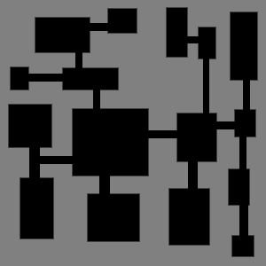
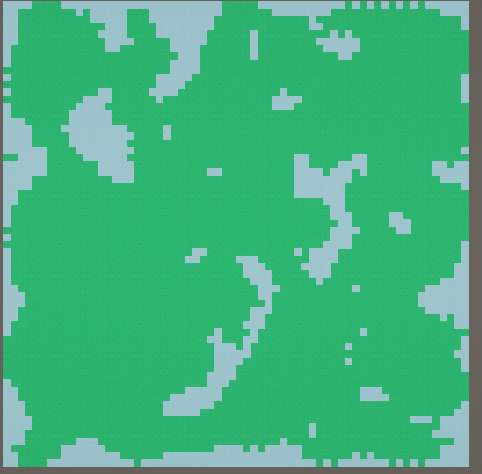
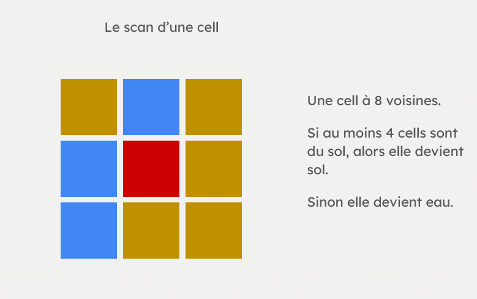
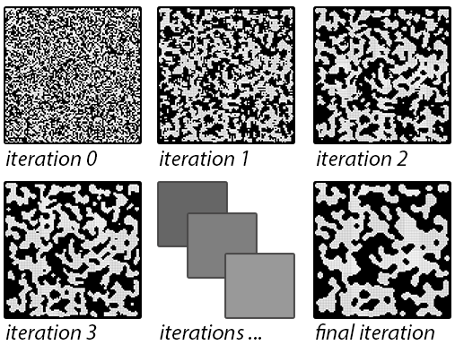

# Procedural Map Generation

## Ressources

Ce projet utilise 2 packages externes à Unity :
- **Architecture Procedural Generation**
- **Unitask**

Installation via OpenUPM : https://openupm.com/packages/com.cysharp.unitask/#modal-manualinstallation

## Getting Started

### Architecture Procedural Generation

Le package **Architecture Procedural Generation** possède déjà un système complet de génération de noise map avec plusieurs paramètres configurables tels que :
- Octaves
- Fréquence
- Type de noise
- Etc.

#### ProceduralGenerationMethod

Il inclut sa propre méthode `ProceduralGenerationMethod` qui permet de créer de nouveaux types de méthodes de génération procédurale à utiliser dans le script **Procedural Grid Generator**.

#### Gestion des Tiles

Le package possède ses propres fonctions permettant de générer une Grid et des tiles de différentes couleurs selon le nom de la tile ou du ScriptableObject :
```csharp
ScriptableObjectDatabase.GetScriptableObject<GridObjectTemplate>("Name");

protected const string ROOM_TILE_NAME = "Room";
protected const string CORRIDOR_TILE_NAME = "Corridor";
protected const string GRASS_TILE_NAME = "Grass";
protected const string WATER_TILE_NAME = "Water";
protected const string ROCK_TILE_NAME = "Rock";
protected const string SAND_TILE_NAME = "Sand";
```

#### Grid

La classe **Grid** permet de :
- Récupérer sa taille
- Récupérer et créer une cellule valide de la grid
```csharp
if (!Grid.TryGetCellByCoordinates(x, z, out var chosenCell))
{
    Debug.LogError($"Unable to get cell on coordinates : ({x}, {z})");
    continue;
}
```

#### GridGenerator

La classe **GridGenerator** permet de placer une tile sur une cellule :
```csharp
AddGridObjectToCell(Cell cell, GridObjectTemplate template, bool overrideExistingObjects);
// ou
AddTileToCell(Cell cell, string tileName, bool overrideExistingObjects); // équivalent
```

## Simple Room Placement

Cette algo permet de créer des salle rectangulaire de differente taille et de les relier par des chemins/couloirs


### Génération des salles
La logique est plutot simple, on prend un point random dans la grid et une taille de romm random 
```csharp
private RectInt GetRandomRoom()
{
    int xPos = RandomService.Range(0, Grid.Width);
    int yPos = RandomService.Range(0, Grid.Lenght);

    int sizeX = RandomService.Range(2, 10);
    int sizeY = RandomService.Range(2, 10);

    RectInt room = new RectInt(xPos, yPos, sizeX, sizeY);
    return room;
}
```
On parcourt l'intégralité de notre Grid en verifiant bien que la Cell ne contient pas deja quelque chose via containObject
```csharp
for (int x = room.xMin - 1; x <= room.xMax + 1; x++)
{
    for (int y = room.yMin - 1; y <= room.yMax + 1; y++)
    {
        if (Grid.TryGetCellByCoordinates(x, y, out Cell cell))
        {
            if (cell.ContainObject)
                return;
        }
    }
}
```
puis on re-parcourt la Grid mais cette fois ci pour poser notre tile de la room et enfin une fois la double boucle finis, on ajoute la room à notre liste de room pour pouvoir faire les couloirs après

### Placement des couloirs
Pour relier les salles entre elles, on parcourt notre liste de rooms et on connecte chaque salle à la suivante en créant un chemin en forme de "L".

La méthode calcule d'abord le centre de chaque salle, puis trace un couloir horizontal jusqu'à atteindre la coordonnée X de la salle cible, et enfin un couloir vertical pour rejoindre la coordonnée Y de destination.
```csharp
private void PlaceCorridors()
{
    for(int i = 0; i < roomList.Count - 1; i++)
    {
        Vector2Int roomStart = roomList[i].GetCenter();
        Vector2Int roomTarget = roomList[i + 1].GetCenter();
        
        int xDir = roomTarget.x > roomStart.x ? 1 : -1;
        int yDir = roomTarget.y > roomStart.y ? 1 : -1;
        
        // Trace le couloir horizontal
        while (roomStart.x != roomTarget.x)
        {
            if(Grid.TryGetCellByCoordinates(roomStart.x, roomStart.y, out Cell cell))
            {
                AddTileToCell(cell, CORRIDOR_TILE_NAME, false);
            }
            roomStart.x += xDir;
        }
        
        // Trace le couloir vertical
        while (roomStart.y != roomTarget.y)
        {
            if (Grid.TryGetCellByCoordinates(roomStart.x, roomStart.y, out Cell cell))
            {
                AddTileToCell(cell, CORRIDOR_TILE_NAME, false);
            }
            roomStart.y += yDir;
        }
    }
}
```

Le paramètre `overrideExistingObjects` est défini sur `false` pour éviter d'écraser les tiles de room déjà placées lors du tracé des couloirs.

## BSP Generation
Cet algorithme utilise la technique de **Binary Space Partitioning** pour diviser récursivement l'espace de la grid en zones de plus en plus petites, créant ainsi une structure arborescente de salles.


### Principe de fonctionnement

Le BSP fonctionne en créant un arbre de Node qui subdivisent progressivement l'espace disponible. Chaque Node représente une zone rectangulaire qui peut être divisée en deux sous-zones (enfants).

### Structure du Node

Chaque `Node` représente une zone de la grid avec :
- Un `RectInt` définissant ses limites (`Bound`)
- Deux enfants potentiels (`Child1` et `Child2`)
- Une référence au service random pour la génération aléatoire
```csharp
public class TestNode
{
    private RectInt _bound;
    private TestNode _child1, _child2;
    private Vector2Int _roomMinSize = new(5, 5);
    
    public bool IsLeaf()
    {
        return _child1 == null && _child2 == null;
    }
}
```

Un node est considéré comme une **feuille** (leaf) s'il n'a pas d'enfants, ce qui signifie qu'il ne peut plus être subdivisé et qu'une salle peut y être placée.

### Division récursive

Lors de la création d'un node, on vérifie d'abord si sa taille est suffisante pour être subdivisée (largeur et hauteur supérieures à `_roomMinSize`).
```csharp
public TestNode(RectInt bound, TestBSP bSP, RandomService random)
{
    _bound = bound;
    BSP = bSP;
    _randomService = random;
    BSP.nodeList.Add(this);
    
    if (Bound.width > _roomMinSize.x && Bound.height > _roomMinSize.y)
    {
        CreateNewNode();
    }
}
```

Si c'est le cas, on appelle `CreateNewNode()` qui va diviser aléatoirement le nœud soit horizontalement, soit verticalement (50% de chance pour chaque).
```csharp
public void CreateNewNode()
{
    bool splitHorizontally = _randomService.Chance(0.5f);

    if (!splitHorizontally)
    {
        // Division verticale (en haut et en bas)
        RectInt splitBoundsBottom = new RectInt(_bound.xMin, _bound.yMin, _bound.width, _bound.height / 2);
        RectInt splitBoundsTop = new RectInt(_bound.xMin, _bound.yMin + _bound.height / 2, _bound.width, _bound.height / 2);

        _child1 = new TestNode(splitBoundsBottom, BSP, _randomService);
        _child2 = new TestNode(splitBoundsTop, BSP, _randomService);
    }
    else
    {
        // Division horizontale (gauche et droite)
        RectInt splitBoundsLeft = new RectInt(_bound.xMin, _bound.yMin, _bound.width / 2, _bound.height);
        RectInt splitBoundsRight = new RectInt(_bound.xMin + _bound.width / 2, _bound.yMin, _bound.width / 2, _bound.height);

        _child1 = new TestNode(splitBoundsLeft, BSP, _randomService);
        _child2 = new TestNode(splitBoundsRight, BSP, _randomService);
    }
}
```

Chaque enfant créé va lui-même tenter de se subdiviser, créant ainsi une structure récursive qui s'arrête quand les zones deviennent trop petites.

### Génération de la map

Une fois l'arbre BSP construit, on parcourt tous les nodes et on place une salle dans chaque feuille (nœud sans enfants).
```csharp
protected override async UniTask ApplyGeneration(CancellationToken cancellationToken)
{
    TestNode root = new TestNode(new RectInt(0, 0, Grid.Width, Grid.Lenght), this, RandomService);
    
    foreach(TestNode node in nodeList)
    {
        if (node.IsLeaf())
        {
            PlacedRoom(node.Bound);
        }
    }
    
    BuildGround(); //meme code que Simple Room
}
```

Le processus est donc :
1. Créer un nœud racine couvrant toute la grid
2. Subdiviser récursivement jusqu'à atteindre la taille minimale
3. Placer une salle dans chaque feuille de l'arbre
4. Construire le sol autour des salles

Cette méthode garantit une distribution équilibrée des salles sur toute la map, contrairement au placement aléatoire simple qui peut créer des zones vides.
Et chaque rooms étant connecté entre elles via l'arbre, il est facile de créer des couloirs entre eux

## Cellular Automata


Cette algo est la raison pour laquelle il y a 2 branch sur mon git
J'ai voulu optimiser la generation de la map

Cet algorithme utilise un **automate cellulaire** pour générer des terrains organiques en deux étapes : génération d'un bruit blanc puis lissage progressif via des règles de voisinage.


### Génération du bruit blanc

La première étape consiste à générer un bruit blanc aléatoire qui servira de base à notre terrain. On parcourt chaque cellule de la grid et on assigne aléatoirement une tile de type "ground" (terre) ou "water" (eau) selon un poids défini.
```csharp
private void PlaceRandomCell()
{
    for (int x = 0; x < Grid.Width; x++)
    {
        for (int z = 0; z < Grid.Lenght; z++)
        {
            if (!Grid.TryGetCellByCoordinates(x, z, out var chosenCell))
            {
                Debug.LogError($"Unable to get cell on coordinates : ({x}, {z})");
                continue;
            }
            
            GridObjectTemplate templateToPlace = RandomService.Chance(groundWeight) ? groundTemplate : waterTemplate;
            GridGenerator.AddGridObjectToCell(chosenCell, templateToPlace, false);
        }
    }
}
```

Le paramètre `groundWeight` (par défaut 0.5) détermine la probabilité qu'une cellule soit de la terre plutôt que de l'eau. Une valeur de 0.5 signifie 50% de chance pour chaque type.

### Lissage par règles de voisinage

Une fois le bruit blanc généré, on applique un algorithme de lissage basé sur le comptage des voisins. Ce processus transforme le chaos initial en formations naturelles et cohérentes.



#### Principe

Pour chaque cellule, on compte combien de ses **8 voisins** (dans toutes les directions) sont de type "ground". Si ce nombre dépasse un seuil défini (`groundCount`), la cellule devient de la terre, sinon elle devient de l'eau.
```csharp
public float groundWeight = 0.5f;
[SerializeField] private int groundCount = 4;
```

- **groundWeight** : Probabilité initiale de placer de la terre (0.0 à 1.0)
- **groundCount** : Nombre minimum de voisins "ground" requis pour qu'une cellule devienne terre

#### Itérations progressives

Plus on répète cette étape de lissage, plus la map devient cohérente et les zones se regroupent naturellement.



Avec plusieurs itérations :
- Les cellules isolées disparaissent
- Les zones de même type se regroupent
- Les contours deviennent plus organiques et naturels

#### Implémentation
```csharp
private void SmoothGrid()
{
    // Définition des 8 directions (voisins directs + diagonales)
    Vector2Int[] directions = new Vector2Int[]
    {
        new Vector2Int(1, 0),   // Droite
        new Vector2Int(-1, 0),  // Gauche
        new Vector2Int(0, 1),   // Haut
        new Vector2Int(0, -1),  // Bas
        new Vector2Int(1, 1),   // Haut-droite
        new Vector2Int(1, -1),  // Bas-droite
        new Vector2Int(-1, 1),  // Haut-gauche
        new Vector2Int(-1, -1)  // Bas-gauche
    };
    
    // Dictionnaire pour stocker les modifications (évite les conflits pendant le parcours)
    Dictionary<Cell, GridObjectTemplate> cellsToUpdate = new Dictionary<Cell, GridObjectTemplate>();
    
    for (int x = 0; x < Grid.Width; x++)
    {
        for (int z = 0; z < Grid.Lenght; z++)
        {
            if (!Grid.TryGetCellByCoordinates(x, z, out Cell currentCell))
                continue;
            
            int groundNeighbors = 0;
            int totalNeighbors = 0;
            
            // Compte les voisins de type "ground"
            foreach (Vector2Int dir in directions)
            {
                int checkX = x + dir.x;
                int checkZ = z + dir.y;
                
                if (Grid.TryGetCellByCoordinates(checkX, checkZ, out Cell neighborCell))
                {
                    if (neighborCell.GridObject != null)
                    {
                        totalNeighbors++;
                        if (neighborCell.GridObject.Template.Name == groundTemplate.Name)
                        {
                            groundNeighbors++;
                        }
                    }
                }
            }
            
            // Applique la règle : si assez de voisins ground, devient ground, sinon water
            if (groundNeighbors >= groundCount)
            {
                cellsToUpdate[currentCell] = groundTemplate;
            }
            else
            {
                cellsToUpdate[currentCell] = waterTemplate;
            }
        }
    }
    
    // Applique toutes les modifications d'un coup
    foreach (var kvp in cellsToUpdate)
    {
        GridGenerator.AddGridObjectToCell(kvp.Key, kvp.Value, true);
    }
}
```

**Point important** : On utilise un dictionnaire temporaire (`cellsToUpdate`) pour stocker toutes les modifications avant de les appliquer. Cela évite que les changements d'une cellule n'influencent le calcul des cellules suivantes pendant la même itération.

### Résultat

Cette technique produit des terrains aux formes organiques et naturelles, parfaits pour créer des îles, des lacs, ou des grottes. En ajustant `groundWeight` et `groundCount`, on peut contrôler la densité et la taille des formations générées.

### Version optimisé
la version optimisé "CA_Optimize" voit 
```cshar^p
    private readonly Vector2Int[] directions = new Vector2Int[]
    {
        new Vector2Int(1, 0),
        new Vector2Int(-1, 0),
        new Vector2Int(0, 1),
        new Vector2Int(0, -1),
        new Vector2Int(1, 1),
        new Vector2Int(1, -1),
        new Vector2Int(-1, 1),
        new Vector2Int(-1, -1)
    };
```
declaré dans la class plutot que dans la méthode puis j'ai crée une nouvelle méthode "Grid.GetCellByCoordinates(x, z, out Cell chosenCell);" qui fait pareil que Grid.TryGetCellByCoordinates(x, z, out var chosenCell) mais ne verifie pas si la cell est valide. Ensuite j'ai créer une nouvelle struct qui servira à modifier le sprite de la prefab de tile plutot que d'un créer une nouvelle

```csharp
    public struct TemplateSprite
    {
        public GridObjectTemplate template;
        public Sprite sprite;
    }
```
et ensuite on remplace le sprite.
```csharp
                TemplateSprite newTemplateSprite;
                if (groundNeighbors >= stoneCount || waterNeighbors <= 0)
                {
                    newTemplateSprite = rock;
                }
                else if (groundNeighbors + stoneNeighbors >= groundCount)
                {
                    newTemplateSprite = ground;
                }
                else
                {
                    newTemplateSprite = water;
                }

                if (currentCell.GridObject?.Template != newTemplateSprite.template)
                {
                    cellsToUpdate.Add((currentCell, newTemplateSprite));
                }
            }
        }

        foreach (var (cell, templateSprite) in cellsToUpdate)
        {
            cell.View.SetCellToGrid(cell, templateSprite.template, templateSprite.sprite);
        }
```

Et ce code permet aussi de modifier uniquement les cell qui doivent changer et pas toute la grid comme le dernier code.

