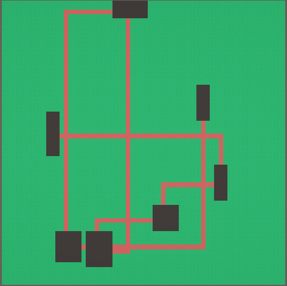

# Procedural Map Generation

## Ressources

Ce projet utilise 2 packages externes à Unity :
- **Architecture Procedural Generation**
- **Unitask**

Installation via OpenUPM : https://openupm.com/packages/com.cysharp.unitask/#modal-manualinstallation

## Getting Started

### Architecture Procedural Generation

Le package **Architecture Procedural Generation** possède déjà un système complet de génération de noise map avec plusieurs paramètres configurables tels que :
- Octaves
- Fréquence
- Type de noise
- Etc.

#### ProceduralGenerationMethod

Il inclut sa propre méthode `ProceduralGenerationMethod` qui permet de créer de nouveaux types de méthodes de génération procédurale à utiliser dans le script **Procedural Grid Generator**.

#### Gestion des Tiles

Le package possède ses propres fonctions permettant de générer une Grid et des tiles de différentes couleurs selon le nom de la tile ou du ScriptableObject :
```csharp
ScriptableObjectDatabase.GetScriptableObject<GridObjectTemplate>("Name");

protected const string ROOM_TILE_NAME = "Room";
protected const string CORRIDOR_TILE_NAME = "Corridor";
protected const string GRASS_TILE_NAME = "Grass";
protected const string WATER_TILE_NAME = "Water";
protected const string ROCK_TILE_NAME = "Rock";
protected const string SAND_TILE_NAME = "Sand";
```

#### Grid

La classe **Grid** permet de :
- Récupérer sa taille
- Récupérer et créer une cellule valide de la grid
```csharp
if (!Grid.TryGetCellByCoordinates(x, z, out var chosenCell))
{
    Debug.LogError($"Unable to get cell on coordinates : ({x}, {z})");
    continue;
}
```

#### GridGenerator

La classe **GridGenerator** permet de placer une tile sur une cellule :
```csharp
AddGridObjectToCell(Cell cell, GridObjectTemplate template, bool overrideExistingObjects);
// ou
AddTileToCell(Cell cell, string tileName, bool overrideExistingObjects); // équivalent
```

## Simple Room Placement

Cette algo permet de créer des salle rectangulaire de differente taille et de les relier par des chemins/couloirs

